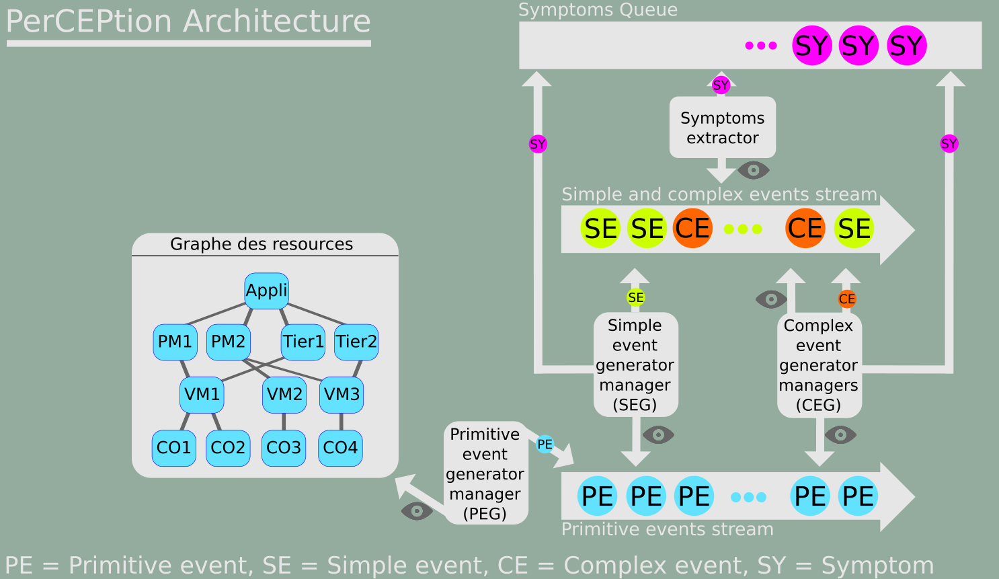

# Framework perCEPtion
Bienvenue sur le dépot officiel du framework perCEPtion !

***
PerCEPTion est un framework de monitoring basé sur le traitement des événements complexes (Complex Event Processing - CEP) permettant de mettre en place une surveillance avancée d'une architecture matérielle et logicielle (Cloud par exemple). En outre, il permet de détecter des signes d'incohérence au sein d'un ensemble de composants d'une architecture. Si des incohérences sont détectées par le framework, celui-ci fournit un ensemble d'informations permettant d'aider à la reconfiguration des composants affectés.
***
Ce Framework a été redesigné à partir d'un framework développé par Simon Dupont et des chercheurs et étudiants de l'Institut Mines-Télécom Atlantique. Apache Flink est utilisé dans la nouvelle version du framework.
Il suit assez fidèlement les concepts de la thèse de Simon Dupont : ["Gestion autonomique de l'élasticité multi-couche des applications dans le Cloud : vers une utilisation efficiente des ressources et des services du Cloud"](https://tel.archives-ouvertes.fr/tel-01344377/)

>La dernière version de framework a été conçue par 4 étudiants de l'Institut Mines-Télécom Atlantique :
>- Chloé GUILBAUD
>- Kendall FOREST
>- Mathieu GUYOT
>- Léo PARIS


## Fonctionnement général

L'image ci-dessous décrit le fonctionnement global du framework perception:



Le framework a pour objectif de monitorer un ensemble de composants d'une architecture. Pour atteindre cet objectif, perCEPtion utilise le CEP (complex event processing) d'une manière ingénieuse:
1. La première étape consiste à générer des évènements dits primitifs. Ceux-ci sont générés constamment. Ils sont donc très nombreux mais peu significatifs.
2. La seconde étape consiste à étudier le flux constant d'évènements primitifs pour essayer d'extraire des informations significatives. De cette étape, sont générés des évènements dis simples et complexes (le premier contient des informations significatives d'une resources, le second d'une ou plusieurs resources).
3. La troisième étape consiste à étudier le flux constant d'évènements simples et complexes afin de sélectionner les plus significatifs et de les considérer comme des symptômes porteurs d'une information sur une anomalie d'une partie du système surveillé.
4. Enfin la pile des symptômes est triée et permet de faire remonter les anomalies du système les plus graves.

> Tous les évènements générés par le système de monitoring embarquent avec eux un
score qui permet de faire remonter les maladies du système en fonction de leur
gravité. En outre, les scores des évènements permettent de trier la pile des symptômes.

Tous les composants de cette image sont décrits en détail ci-dessous.

### Évènements

Voici les différents types d’événements qui sont utilisés dans perCEPtion:

|Type d'évènement| Description |
|---|---|
| Primitive event(PE) |  Un événement primitif contient une information sur un seul composant de l'architecture qui est surveillée. Il est obtenu grâce à des composants appelés primitive events generator (PEG). |
| Simple event (SE) | Un événement simple contient une ou plusieurs informations sur un seul composant de l'architecture qui est surveillée. Il est obtenu grâce à des composants appelés simple events generator (SEG). |
| Complex event (CE) | Un événement complexe contient une ou plusieurs informations sur un ou plusieurs composants de l'architecture qui est surveillée. Il est obtenu grâce à des composants appelés complex events generator (CEG). |
| Symptom (Sy) | Tout comme un évènement complexe, un symptôme contient  une ou plusieurs informations sur un ou plusieurs composants de l'architecture qui est surveillée. Il est obtenu par les SEGs, CEGs, ou bien les symtoms extractors.|

### Générateurs d'évènements primitifs

Pour générer des évènements primitifs, nous utilisons des générateurs d'évènements primtifs ! (PEG pour Primitive event generator).

Chaque PEG observe le graphe de ressources à une cadence x donnée (en millisecondes), et passe en revue chaque ressource de ce graphe.
Lors de ce passage en revue, un évènement primitif peut être généré ou non.

Si un évènement primitif est créé, il est envoyé vers la primitive event stream.

Voici un exemple de PEG pouvant être créé par un admistrateur réseau.
Comme vous pouvez le voir, créer son propre PEG est très simple, il suffit
d'hériter de la classe PrimitiveEventGenerator et d'implémenter la méthode
processResource.
```java
/**
 * PEG used to monitor Cpu usage of PM cloud resources
 */
public class PEG_Pm_Cpu extends PrimitiveEventGenerator {

    /**
     * Constructor of the PEG
     * @param name Name of the PEG
     * @param msRefreshingRate Refreshing rate in milliseconds
     */
    public PEG_Pm_Cpu(String name, long msRefreshingRate) {
        super(name, msRefreshingRate);
    }

    /*
     * Processing function of the PEG, Call for each Cloud resources
     * every msRefreshingRate milliseconds
     */
    @Override
    protected Optional<PrimitiveEvent> processResource(CloudResource cr) {
        //If the resource is a PM, we want to generate a primitive event
        if(cr.getType() == CloudResourceType.PM) {
            String crName = cr.getName();
            CloudResourceType crType = cr.getType();
            int score = cr.getScore();
            int cpuConsumption = ((PM)cr).getCpuConsumption();
            PE_Cpu pe_Cpu = new PE_Cpu(crName, crType, score, cpuConsumption);
            return Optional.of(pe_Cpu);
        }
        //Else, generate nothing
        return Optional.empty();
    }

}
```

### Générateurs d'évènements simples

Pour générer des évènements simples, nous utilisons des générateurs d'évènements simples ! (SEG pour Simple event generator).

Chaque SEG observe en continu la primitive event stream, et essaye de détecter un pattern (une liste de PE) défini par le concepteur du SEG.
Si un pattern est reconu, il est traité par le SEG et un Simple event peut être créé. (Voir même un symptôme si l'information récupérée est très significative).

Voici un exemple de SEG pouvant être créé par un admistrateur réseau.
Comme vous pouvez le voir, créer son propre SEG est très simple, il suffit
d'hériter de la classe SimpleEventGenerator et d'implémenter les méthodes
getPattern (pattern de reconnaissance du SEG) et getPatternSelectFunction (fonction de traitement des patterns détectés).

```java
/**
 * SEG used to detect cpu consumption drop from a cloud resource.
 */
public class SEG_Cpu_Drop extends SimpleEventGenerator {

    int normalCpuCadency;
    int anormalCpuCadency;
    int msDetectionWindown;

    //Constructor of the SEG
    public SEG_Cpu_Drop(String name, int normalCpuCadency,
                        int anormalCpuCadency, int msDetectionWindown)
    {
        super(name);
        this.normalCpuCadency = normalCpuCadency;
        this.anormalCpuCadency = anormalCpuCadency;
        this.msDetectionWindown = msDetectionWindown;
    }

    @Override
    public Pattern<PrimitiveEvent, ?> getPattern() {
        return Pattern
                //We looking for a PE which contains a normal cpu consumption of the cloud resource.
                .<PrimitiveEvent>begin("IDLE")
                .subtype(PE_Cpu.class)
                .where(new IterativeCondition<PE_Cpu>() {
                    @Override
                    public boolean filter(PE_Cpu pe_cpu, Context<PE_Cpu> context) throws Exception {
                        if(pe_cpu.getCpuValue() > normalCpuCadency) {
                            return true;
                        }
                        return false;
                    }
                })
                //We ignore all PEs that are not PE_Cpu PEs
                .next("IGNORE")
                .oneOrMore()
                .optional()
                .where(new IterativeCondition<PrimitiveEvent>() {
                    @Override
                    public boolean filter(PrimitiveEvent pe, Context<PrimitiveEvent> context) throws Exception {
                        if(pe.getClass() == PE_Cpu.class) {
                            return false;
                        } else {
                            return true;
                        }
                    }
                })
                //We now looking to a PE which contains an anormal cpu consumption
                .next("CPU DROP")
                .subtype(PE_Cpu.class)
                .where(new IterativeCondition<PE_Cpu>() {
                    @Override
                    public boolean filter(PE_Cpu pe_cpu, Context<PE_Cpu> context) throws Exception {
                        if(pe_cpu.getCpuValue() < anormalCpuCadency) {
                            return true;
                        }
                        return false;
                    }
                })
                //All of this in a ms interval specified
                .within(Time.milliseconds(msDetectionWindown));
    }

    @Override
    public PatternSelectFunction<PrimitiveEvent, Event> getPatternSelectFunction() {
        return new PatternSelectFunction<PrimitiveEvent, Event>() {
            @Override
            public Event select(Map<String, List<PrimitiveEvent>> map) throws Exception {
                boolean isSecondPE = false;
                int cpuHigh = 0, cpuLow = 0;
                //Iterate all the list of primitive event stored in the pattern
                for (List<PrimitiveEvent> p : map.values()) {
                    for (PrimitiveEvent pe : p) {
                        //If the event is the first PE_Cpu monitored (with high cpu)
                        if(pe.getClass() == PE_Cpu.class && !isSecondPE) {
                            cpuHigh = ((PE_Cpu) pe).getCpuValue();
                            isSecondPE = true;
                        }
                        //If the event is the second PE_Cpu monitored (with low cpu)
                        else if(pe.getClass() == PE_Cpu.class && isSecondPE) {
                            cpuLow = ((PE_Cpu) pe).getCpuValue();
                            SE_Cpu_Drop seCpuDrop = new SE_Cpu_Drop(pe.getCloudResourceName(),
                                                                     pe.getCloudResourceType(),
                                                                     pe.getScore(),
                                                                     cpuHigh,
                                                                     cpuLow);
                            //Create a simple event
                            return seCpuDrop;
                        }
                    }
                }
                //In case of bad pattern definition by operator... Should never happen
                return null;
            }
        };
    }
}
```

### Générateurs d'évènements complexes

### Extracteurs de symptômes

## Système de configuration dynamique des events

### Format du fichier XML

Le format du fichier XML a été définit à l'aide du schéma XSD suivant disponible dans 
le dossier `resources/schema.xsd`. Il est bien de lié l'ensemble des fichiers de configuration
crées à ce shéma pour en valider le bon formatage.

Voici un exemple simple de fihcier de configuration XML :
```XML
<?xml version="1.0" encoding="UTF-8"?>
<perception
        xs:noNamespaceSchemaLocation="../../../../../resources/schema.xsd"
        xmlns:xs="http://www.w3.org/2001/XMLSchema-instance"
>
    <events>
        <primitives>
            <primitive enabled="true">
                <name>MonPEGBlank</name>
                <type>PEG_Blank</type>
                <runtime>60000</runtime>
            </primitive>
            <primitive enabled="true">
                <name>MonPEGPmCpu</name>
                <type>PEG_Pm_Cpu</type>
                <runtime>12000</runtime>
            </primitive>
            <primitive enabled="false">
                <name>MonPEGPmDisk</name>
                <type>PEG_Pm_Disk</type>
                <runtime>89100</runtime>
            </primitive>
        </primitives>
        <simples>
            <simple enabled="true">
                <name>MonSimpleEvent1</name>
                <type>SE_Cpu_Drop</type>
                <params>
                    <param tag="tag1" type="Long">45958</param>
                    <param tag="tag2" type="String">Param1</param>
                    <param tag="tag3" type="String">param2</param>
                    <param tag="tag4" type="Integer">78</param>
                </params>
            </simple>
            <simple enabled="true">
                <name>MonSimpleEvent2</name>
                <type>SEG_Cpu_Overload</type>
                <params>
                    <param tag="ip4" type="Long">1245</param>
                    <param tag="port" type="String">localhost:8080</param>
                    <param tag="monParam3" type="String">param3</param>
                    <param tag="monParam4" type="Integer">45</param>
                </params>
            </simple>
        </simples>
        <complexes>
            <complex enabled="true">
                <name>MonSimpleEvent1</name>
                <type>CE_Cpu_Dead</type>
                <params>
                    <param tag="tag1" type="Long">45958</param>
                    <param tag="tag2" type="String">Param1</param>
                    <param tag="tag3" type="String">param2</param>
                    <param tag="tag4" type="Integer">78</param>
                </params>
            </complex>
            <complex enabled="true">
                <name>MonSimpleEvent2</name>
                <type>CE_Cpu_Dead</type>
                <params>
                    <param tag="ip4" type="Long">1245</param>
                    <param tag="port" type="String">localhost:8080</param>
                    <param tag="monParam3" type="String">param3</param>
                    <param tag="monParam4" type="Integer">45</param>
                </params>
            </complex>
        </complexes>
    </events>
</perception>
```

Les primitives events sont définit par un nom unique et le type d'event générator a instancier ainsi que leur runtime.
Les simples et complexes events présentent une structure commune. Ces deux events cont définit par un nom unique, leurs types
ainsi qu'une suite de params. Ces paramètres correspondent à ceux employé par le contructeur Java de l'event generator. Les types
doivent correspondre au paramètre du contructeur. Les tag ne sont pas traitées par le parser mais offre à l'utilisateur le confort
de renseigner des informations complémentaire.

Tout les types d'event comporte un attribut, dans le fichier XML, `enabled` qui indique 
au moteur de configuration si cet event generator doit être activé ou non. Par défaut, 
si cet élément est absent, l'élément sera instancié.


Comme aborder dans la section portant sur le sytème de plugin, il est possible pour 
l'utilisateur de définir ces propres event generators. Ces nouveaux types peuvent être 
renseigner dans le fichié de configuration et leur instanciation sera réalisé comme 
pour les types mit à disposition par perCEPtion.

### Principe de fonctionnement

Le moteur de parse du fichier de configuration dynamique d'event est divisé en trois partie.
Tout débute par la validation du fichier fournit à l'aide du schéma XSD. S'il est valide, 
le parsing peux débuter. C'est alors que les informations fournit sont transformées en 
objet métier. Ces dernier sont fournit à l'activator chargé d'instancier les events generators.


#### Modèle 

La partie modèle du moteur comprend un ensemble de classes permettant 
l'enregistrement des informations pour l'instanciation des event generators.
Ces éléments seront ensuite transmise à l'activateur pour lancement.

On notera une différence entre le format des primitives events et celui
employé pour les simples et complexes (voir la section traitant du format du 
fichier de configuration). Ces deux derniers hérite de `EventData` 
définisant leur structure commune.


#### Validation et parse de fichiers de configuration XML

Dans le but de rendre le sytème facile à faire évoluer, plusieurs énumérations ont été définit et permettent le traitement des éventuelles erreurs
en définisant une liste d'erreur pouvant survenir.
Les erreurs liées au traitement de fichier sont lister dans `FileErrorType`.
Pour la validation, il s'agit de `ValidatorErrorType`.
C'est `ParsingErrorType` qui est utilisé pour les erreurs liée au parsing du fichier.

Toujours dans une volonté de rendre le système adaptable, l'énumération `XMLFileStructure`,
comprend les balises attendu dans le fichier XML. Ainsi en cas d'évolution de sont format
ou de mise à jour des nom employé, il suffit de modifier cette liste sans se sousier
de leur emploi au sein du moteur.

Validateur comme parseur définsent leur propre points d'entré respectivement à l'aide des classes utilitaires
`XMLFileValidator` et `XMLFileParser`. Chacun d'eux retourne des objets rprésentatif des résultats obetenu 
`ValidationResult` et `ResultatParsing`. 

Au final, le moteur de parse retourne un objet de type `ResultatParsing` comprenant l'enseblple des erreurs 
propres au traitement du ficheir de configuration, à la validation et au parsing.
Cela permet au module d'activation de récupéré l'ensemble des informations de pour l'instanciation mais aussi 
les erreurs rencontrée et de les faire remonter à l'utilisateur.

#### Activator


### Ajouter un system de parse

L'architecture du projet perCEPtion permet d'ajouter un système de parse pour un nouvel
élement de façon très simple. Il est possible de créer un nouvel élement présentant le
même format de configuration que celui est simple ou complex events. Pour ce faire, deux 
étapes sont à réaliser.

#### Mise à jour du schéma XSD
Tout d'abord, il est nécessaire de modifier le schéma XSD du module de configuration 
dynamique. Celui-ci est disponible dans `resources/schema.xsd`. 

Voici la structure utilisé pour les simples events : 
```XML
<xsd:element name="simple">
	<xsd:complexType>
	    <xsd:sequence>
		    <xsd:element name="name" type="event_name_type" minOccurs="1" maxOccurs="1"/>
			<xsd:element name="type" type="simple_event_type_type" minOccurs="1" maxOccurs="1"/>
			<xsd:element ref="params" minOccurs="1" maxOccurs="1"/>
		</xsd:sequence>
		<xsd:attribute name="enabled" use="required" type="event_activated"/>
	</xsd:complexType>
</xsd:element>

<xsd:element name="simples">
	<xsd:complexType>
		<xsd:sequence>
			<xsd:element ref="simple" minOccurs="1" maxOccurs="unbounded"/>
		</xsd:sequence>
	</xsd:complexType>
</xsd:element>
```

Il suffit d'ajouter la nouvelle structure au schéma selon l'exemple précédent et puis
d'ajouter cet élément à la liste des events du schéma XSD dans l'élément suivant :

```XML
<!-- Events -->
<xsd:element name="events">
    <xsd:complexType>
        <xsd:sequence>
            <xsd:element ref="primitives"  minOccurs="1" maxOccurs="1"/>
            <xsd:element ref="simples"  minOccurs="1" maxOccurs="1"/>
            <xsd:element ref="complexes"  minOccurs="1" maxOccurs="1"/>
        </xsd:sequence>
    </xsd:complexType>
</xsd:element>
```

#### Implémentation du parser

Maintenant que le shéma XSD est en mesure de traiter notre nouvelle élément, nous
allons pouvoir implémenter le parser.

Lors du parse du fichier de configuration, un objet de type `ResultatParsing` est mit
à disposition. Celui comprend les éventuelles erreur lié au traitement ou à la validation
du fichier mais aussi l'ensembles des informations figurant dans le XML et qui permettrons
l'imnstanciation des generator events. Ces éléments sont enregistré sous forme de liste 
de `EventData`. Il faut donc créer une classe implémentant cette classe abstraite.
Il suffit de redefinir la méthode `toString()`.

Prenons l'exemple des simple events, une classe `SimpleEventData` qui implémente
`EventData`. En ce qui concerne le `ResultatParsing` une liste de `SimpleEventData`
 a été ajouté en attribut. Les méthodes suivante sont aussi à ajouter :
- `addSimpleEvent(SimpleEventData simpleEventData)`,
- `addAllSimpleEvents(List<SimpleEventData> simpleEventDataList)`,
- `existingSimpleEventListWithName(String name)`.

Bien entendu, les getters et setters sont a créer et la méthode `toString()`.

Comme évoqué précédement la classe abstraite `XMLFileParseToEventData` définit l'ensemble 
des méthodes permettant le parse des éléments présentant un ensemble de paramètres.
Dans notre exemple, la classe `XMLFileParserToSimpleEventData` hérite de `XMLFileParseToEventData`.

Il suffit de suivre le même cheminement que celui utilisé pour les simples events pour
permettre le parsing du nouvel élément.

La classe utilitaire `XMLFileParser` doit aussi être mise à jour.  

#### TU 

... tests unitaires oont été mit en place pour permettre la validation du moteur 
de configuration dynamique de generator events.

## Utilisation du Framework

Nous avons fait en sorte que l'utilisation du framework soit le plus simple possible !
Les sections ci-dessous détaillent comment utiliser perCEPtion.

### Configuration des EG via le fichier XML

Il suffit de créer un fichier XML, respectant le schéma xsd défini et fourni dans l'archive.

Il faut définir le type, qui correspond à la classe d'implémentation de l'Event Generator, le nom qui sera donné à l'EG, et pour les SEG et les CEG, il faudra donner l'ensemble des paramètres à envoyer au constructeur de la classe.

/!\ ATTENTION : la liste des paramètres et le leur types doivent être fournis dans le même ordre que dans le constructeur. /!\


# Axes d'amélioration et évolutions possibles

En terme d'évolution du framework perCEPtion, il serait bien de finaliser la conception
 et la rédaction des tests unitaires du moteur de configuration dynamique d'event generator.
 Pour valider le bon fonctionnement du système dans son ensemble, des TU devront être
 mit en place.


# En travaux !


- TODO
    - système de plugin !
    - c'est ou qu'on le met le fichier de conf pour que perCEPtion le traite tout
    seul comme un grand ? 
